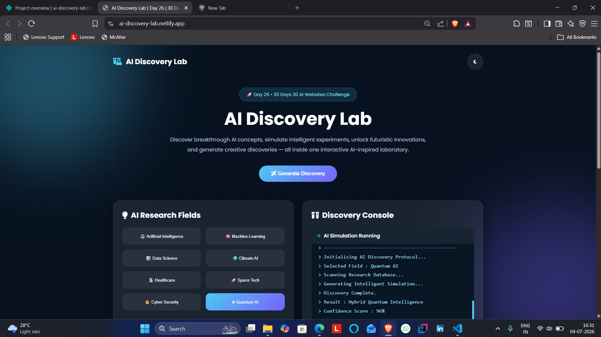
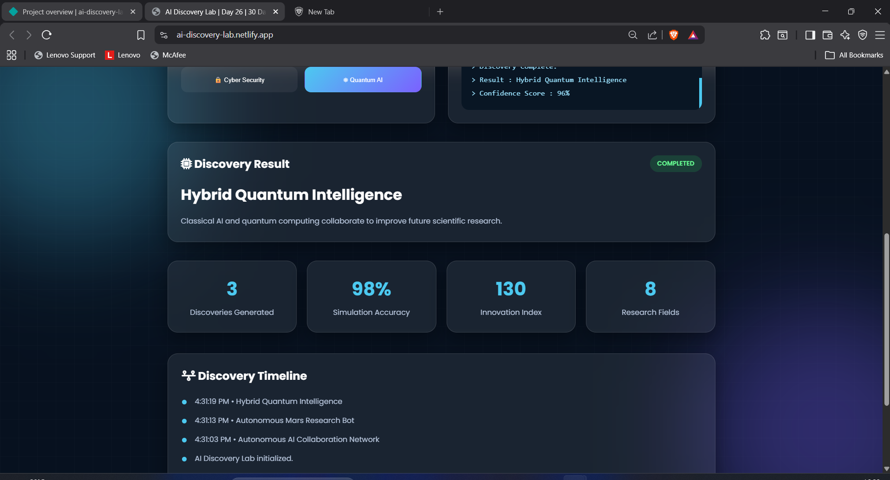

# AI Discovery Lab

## 🚀 Day 26 of my 30 Days 30 AI Websites Challenge

AI Discovery Lab is an AI-inspired web application designed to simulate how intelligent research laboratories may operate in the future.

Instead of simply displaying AI information, the platform allows users to explore different AI research domains, generate simulated scientific discoveries, and visualize futuristic innovations across multiple fields including Artificial Intelligence, Machine Learning, Data Science, Healthcare, Climate AI, Space Technology, Cyber Security, and Quantum AI.

The application demonstrates how AI can accelerate research by generating breakthrough ideas, simulating intelligent experiments, maintaining a live discovery console, tracking research history, and presenting innovation statistics through an interactive dashboard.

---

## 🌐 Live Demo

https://ai-discovery-lab.netlify.app/

---

## 📸 Screenshots

---

## ✨ Features

- AI Discovery Generator
- Multiple AI Research Domains
- Scientific Innovation Simulation
- Interactive Discovery Console
- Live Research Timeline
- AI Discovery Dashboard
- Innovation Statistics
- Dynamic Discovery Results
- Dark / Light Mode
- Fully Responsive Design

---

## 📋 How It Works

1. Open AI Discovery Lab.
2. Select a research field.
3. Click **Generate Discovery**.
4. Watch the AI Discovery Console simulate the research process.
5. View the generated breakthrough.
6. Track discoveries in the timeline.
7. Explore different AI research domains.

---

## 🛠️ Technologies Used

- HTML
- CSS
- JavaScript
- Built with the help of AI-assisted development tools

---

## 🎯 Challenge Progress

✅ Day 26 Completed — AI Discovery Lab

Part of my **30 Days 30 AI Websites Challenge**, where I build and publish one AI-powered web project every day to improve my frontend development, product-building, UI/UX design, and problem-solving skills.

---

## 👨‍💻 Author

**Bettam Anand**

**BTech CSE(Data Science)**
B.Tech CSE (Data Science)

JNTUH University College of Engineering Palair
